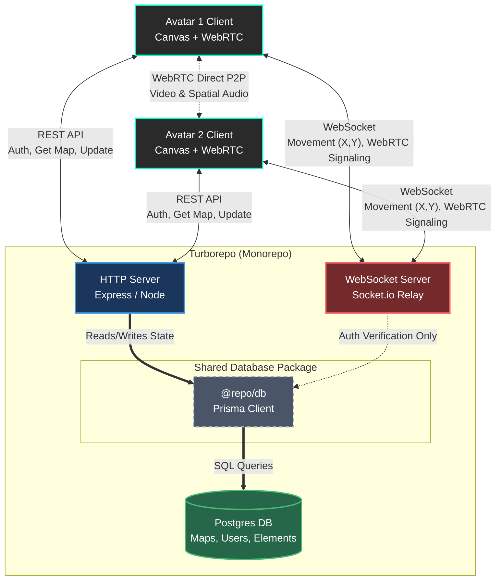
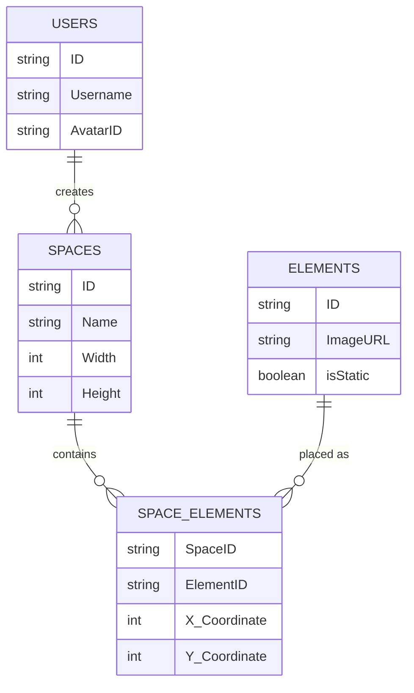

# 🌐 Google Meet Metaverse (Web3)

## 🎯 Functional Requirements
*   Real-time Peer-to-Peer (P2P) video streaming.
*   Spatial audio and Web3 Wallet Login.

## ⚙️ How it Works
Avatars render on a 2D Canvas. When two avatars are close, WebRTC establishes a direct P2P connection between their browsers.

## 📂 File Structure (Step-by-Step)
```text
/server
 ├── signaling.ts       (WebSocket server to relay WebRTC offers/answers)
/client
 ├── src/
 │    ├── canvas/
 │    │    └── WorldRenderer.ts  (Vanilla JS HTML5 Canvas loop)
 │    ├── web3/
 │    │    └── MetaMaskAuth.ts   (Ethers.js integration)
 │    └── webrtc/
 │         └── PeerConnection.ts (Manages the video/audio streams)
```

## 🧮 Algorithms to Master
*   **Pythagorean Theorem (Distance Formula):** `sqrt((x2-x1)^2 + (y2-y1)^2)` to calculate volume based on avatar proximity (Spatial Audio).
*   **WebRTC ICE Negotiation:** Handshaking algorithm to bypass NAT firewalls.

## 💻 Tech Stack (No Constraints)
*   **Backend:** Node.js + Socket.io (Signaling).
*   **Frontend:** Vanilla JS Canvas + Ethers.js + Vanilla CSS.

## 🧠 The Dual-Brain Architecture (Scale Upgrade)
This architecture fundamentally separates **State (Memory)** from **Velocity (Reflexes)** to handle 10K+ concurrent users without DB locking.

### 1. Separation of Concerns
1. **The State Engine (HTTP):** Handles standard CRUD operations (Signup/Signin, Create Space, Get Maps, Update Metadata). Returns JWTs for auth.
2. **The Velocity Engine (WebSocket):** Pure, dumb speed relay server for low-latency movement (X,Y updates) and WebRTC handshakes. No DB connection here if possible to keep it lean. "Sticky connections" to the same WS server per room.
3. **Database (Postgres via Prisma):** Stores Users, Avatars, Maps, Elements, and Map-Element mappings (many-to-many via explicit tables).



### 2. The Database Matrix (Map-Element Join)
To allow multiple users to see the exact same chair in the same coordinate dynamically, elements are mapped to spaces via a join table.


